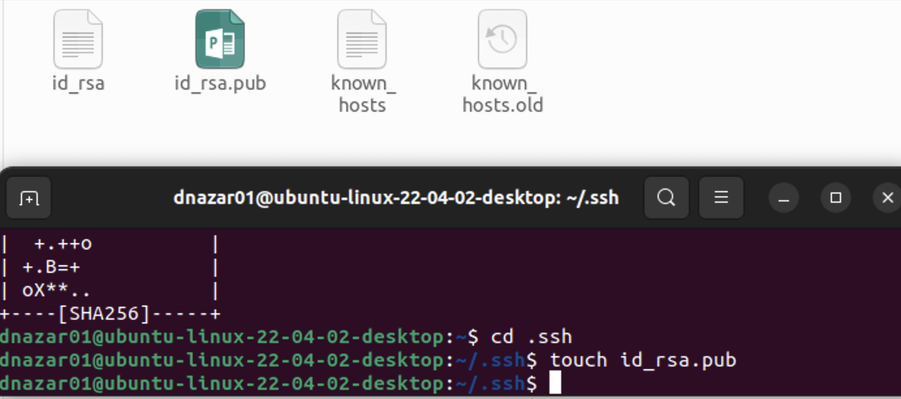
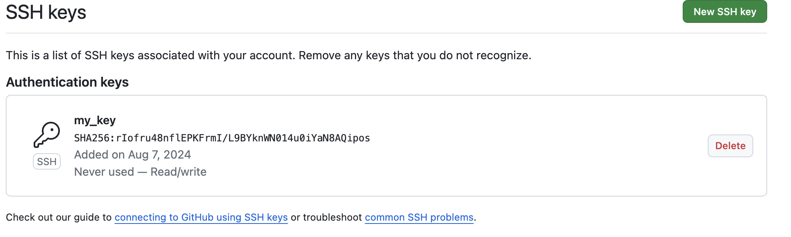
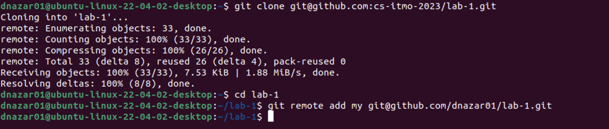
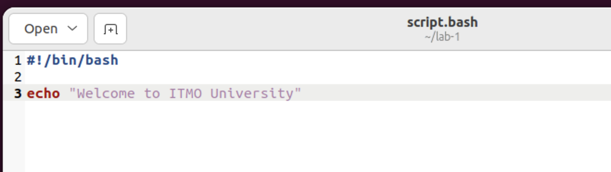
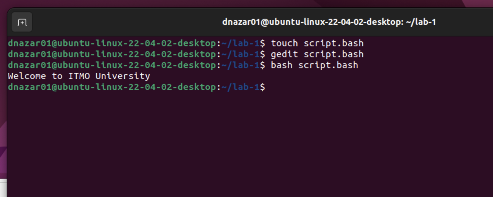
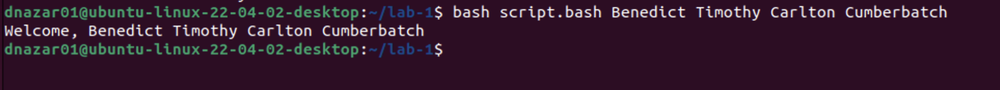

# Лабораторная работа 1

## Цель:

Приобрести практические навыки работы в Linux-системе, изучить основные команды и инструменты командной строки, овладеть
базовыми командами Git для создания, изменения и отправки кода в удаленный репозиторий и разработать простой bash
скрипт.

## Задачи:

- Установить SSH-ключи.
- Клонировать репозиторий с заданием лабораторной работы.
- Написать и выполнить простой bash-скрипт, выводящий приветственное сообщение
- Модифицировать скрипт и добавить ему возможность получения аргументов командной строки

## Основная часть

SSH ключи были сгенерированы и затем добавлены на GitHub.



Затем был клонирован репозиторий лабораторной работы и добавлено подключение к собственному репозиторию.



В основной директории был создан Bash скрипт с приветственным сообщением. Позже он был исполнен в терминале.





Далее скрипт был модифицирован, была добавлена возможность получения аргументов командной строки.

Код и пример вывода:

```bash
#!/bin/bash
text="$@"
echo "Welcome, $text"
```



## Вывод

В ходе лабораторной работы были изучены азы работы с Linux через терминал, освоены навыки установки SSH-ключей, клонирования и работы с репозиториями, а также выполнения и модификации bash-скриптов.


