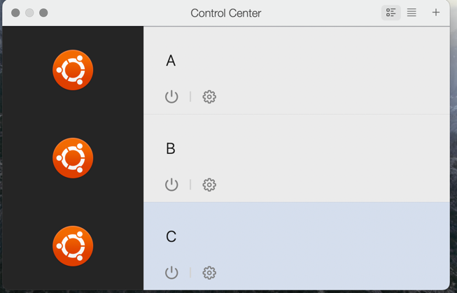
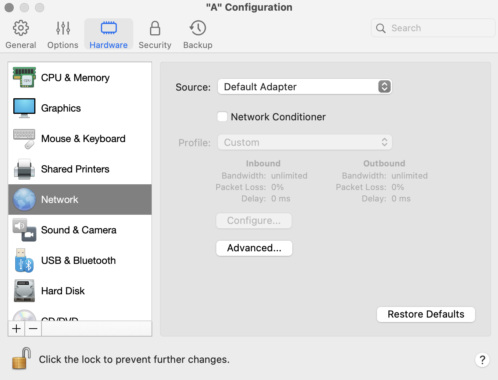
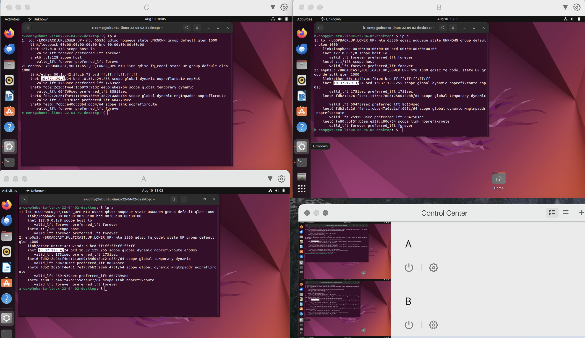
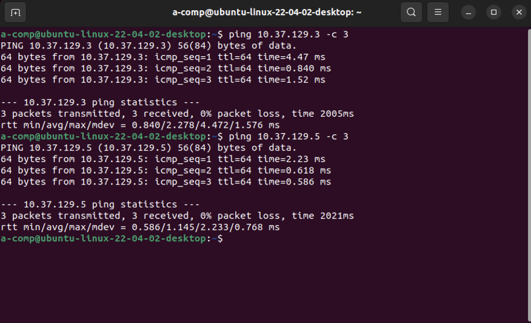
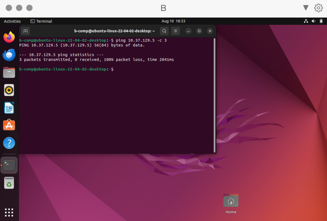
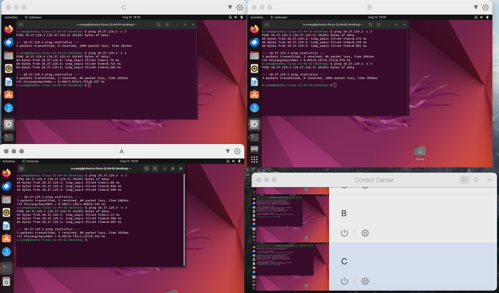

# Лабораторная работа 3

## Цель:

Освоить практические навыки такие, как создание и настройка виртуальных машин с использованием VirtualBox (Parallels
Desktop),
а также установка и конфигурирование сетевых соединений между ними.

## Задачи:

- Создать и настроить виртуальную машину A, обеспечить ей доступ в сеть Интернет.
- Настроить виртуальную машину B, обеспечить сетевой доступ от машины А к машине В.
- Настроить виртуальную машину С, обеспечить сетевой доступ от машины А к машине C. Запретить сетевой доступ из машины B
  в машину С.
- Проверить все доступы, приложить скриншот, на котором будут видны терминалы трех машин.

## Основная часть

Были созданы виртуальные машины A, B, C. Машине А был обеспечен доступ в интернет через настройку ее сетевой
конфигурации.
Значок "настройки" -> Hardware -> Network -> Source -> Default adapter.





Проверка доступа машины А к сети интернет:


Была создана новая сеть - host-only (.. -> Network -> Advanced -> Open network preferences). Затем во всех виртуальных
машинах в настройках сетевой конфигурации был выбран пункт host-only network (Source -> Host-Only) и были найдены ip
адреса каждой из машин с помощью команды ```ip a```. Таким образом, у машины A он равен ```10.37.129.4```, у В он равен
```10.37.129.3```, а у С он равен ```10.37.129.5```.




Далее был проверен сетевой доступ из машины А в машину B и C.



После этого с помощью фаервола iptables и общего сетевого интерфейса enp0s3 на машине C была настроена блокировка
доступа
машины B к машине C. Команда: ```sudo iptables -A INPUT -s 10.37.129.3 -j DROP```.

До:


После:



Как итог - скриншот с проверкой всех сетевых доступов.



## Вывод

В ходе лабораторной работы были созданы 3 виртуальные машины с Ubuntu в Parallels Desktop, настроены сетевые подключения
между ними, и реализована блокировка доступа между машинами с использованием iptables.

### Nota bene

Решение использовать Parallels Desktop было принято в связи с тем, что у меня Macbook m1 8/256, на котором пока не
работает VirtualBox. Я пробовал много разных версий данного приложения, но к сожалению, на любые попытки создать
виртуальную машину с системой Ubuntu, VirtualBox кидал критическую ошибку и система в итоге не запускалась.