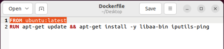
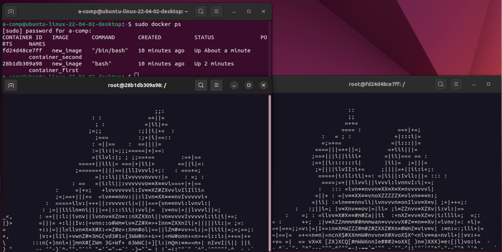
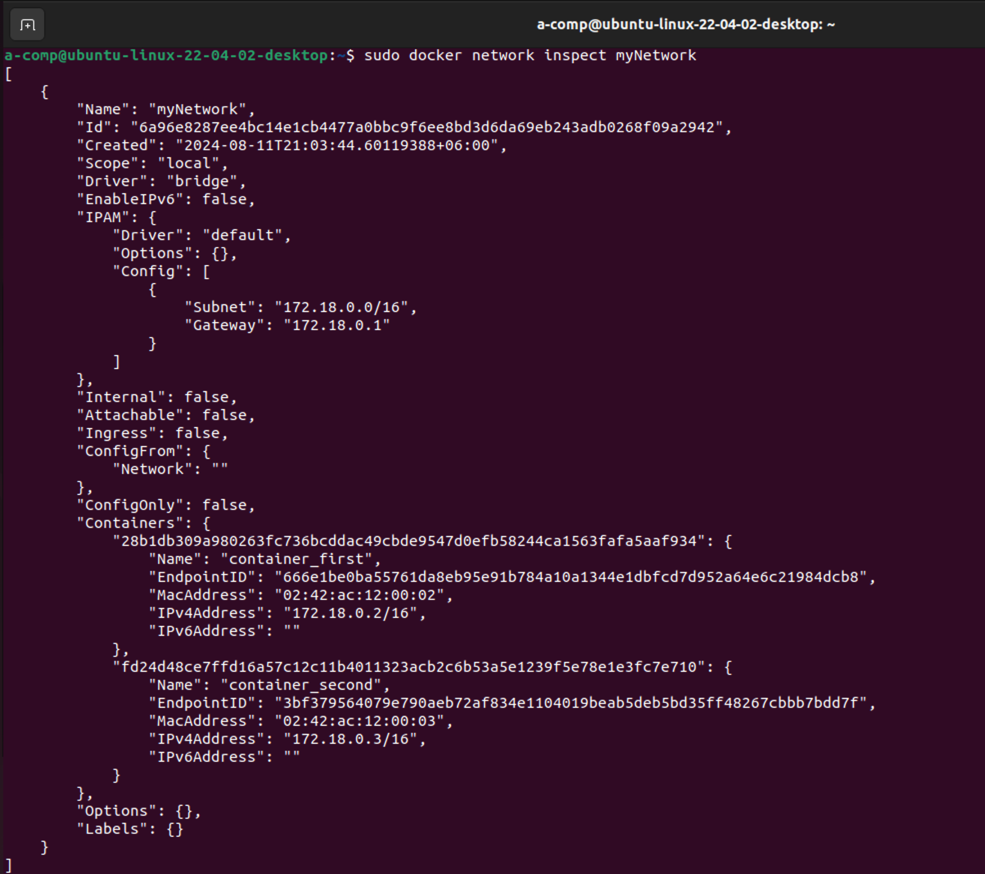
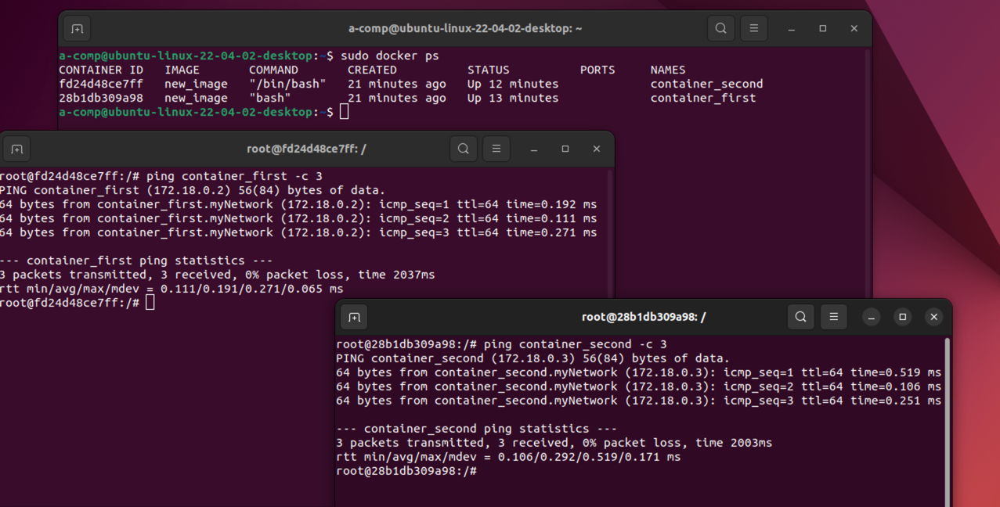

# Лабораторная работа 4

## Цель:

Освоить основы работы с Docker, включая создание Docker-образов и управление контейнерами. Научиться запускать приложения
внутри контейнеров и управлять сетью между ними.

## Задачи:

- Установить Docker на виртуальную машину.
- Создать Docker-образ
- Запустить два контейнера на основе созданного образа и продемонстрировать работу приложения aafire. 
- Настроить сеть между двумя контейнерами, аналогично предыдущей работе с виртуальными машинами. 
- Убедиться в возможности связи между контейнерами с помощью утилиты ping.

## Основная часть

Открыл пустой текстовой документ и прописал Dockerfile, в нем указал операционную систему, на основе которой будет работать
файл (ОС, которая используется), обновил пакетный менеджер и установил пакеты для aafire и утилиты ping.



Далее командой ```sudo docker build -t new_image .``` создал образ ```new_image``` в текущей директории. Затем командой 
```sudo docker run --name container_first -it new_image bash``` и командой ```sudo docker run --name container_second -it new_image bash```
создал два контейнера на основе созданного образа и запустил их в режиме bash. С помощью команды ```aafire``` в каждом из
терминалов созданных контейнеров было запущено нужное приложение.



Далее с помощью команды ```sudo docker network create myNetwork``` была создана сеть, к ней я подключил свои контейнеры 
командой ```sudo docker network connect myNetwork <имя контейнера>```. Ниже фото настроек этой сети:



Утилитой ping было протестировано соединение между контейнерами.



## Вывод

В ходе лабораторной работы я закрепил навыки работы с Docker такие, как создание образов, запуск и управление контейнерами,
а также настройку сети между контейнерами.

