# Лабораторная работа 5

## Цель:

Освоить Git, выполнив задания расширенного семинара по нему.

## Задачи:

- Создание репозитория со структурой для будущих задач, выполнение базовых команд.
- Работа с ветками.
- Работа с удаленным репозиторием.
- Моделирование конфликта.
- Разрешение конфликта.
- Автоматизация проверки формата файлов при коммите.
- Использование Git Flow в проекте.

## Основная часть

### 1)Введение

В самом начале был создан репозиторий git-practice, далее его url был скопирован и репозиторий был клонирован в локальную
папку. Также, чтобы работала команда push, мне необходимо было сделать персональный токен в github и использовать его для
аутентификации, иначе данная команда бы не выполнялась.

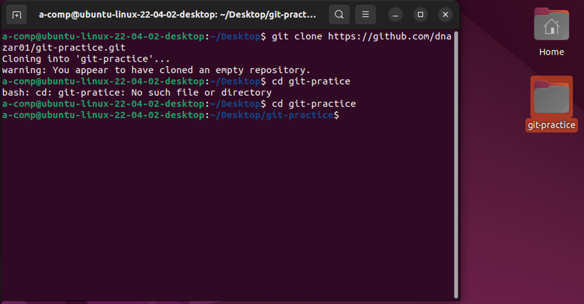

Затем в локальной папке был создан ```example.txt```, с помощью команды ```nano example.txt``` я его отредактировал и все
изменения закоммитил и запушил в репозиторий.

```
git add example.txt
git commit -m "File added example.txt"
git push origin main
```

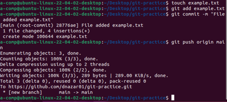

Создал новую ветку feature-branch и переключился на нее с помощью команды:

```
git checkout -b feature-branch
```

Отредактировал файл ```example.txt```, добавив еще одну главу. Закомиттил изменения и отправил их на ветку.

```
git add example.txt
git commit -m "Added Chapter 2"
git push origin feature-branch
```

Переключился на основную ветку и слил изменения из ветки feature-branch в нее.

```
git checkout main
git merge feature-branch
git push origin main
```

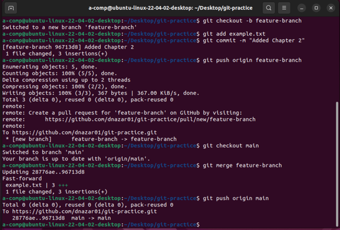

### 2)Работа с ветками

Создал файл ```README.md``` в текущей папке с базовой структурой книги:

```
# Название книги

## Глава 1: Введение
Здесь будет введение в тему книги.

## Глава 2: Основы Git
Основные понятия и команды Git.

```
Затем создал ветку ```feature-login``` для новой функциональности. Внес изменения в файл,
добавив 3 главу:

```
# Название книги

## Глава 1: Введение
Здесь будет введение в тему книги.

## Глава 2: Основы Git
Основные понятия и команды Git.

## Глава 3: Вход в систему
Раздел по новой функциональности входа в систему.

```

Завершил изменения и отправил их в ветку на Github.

```
git add README.md
git commit -m "Добавлена глава 3: Вход в систему"
git push origin feature-login
```

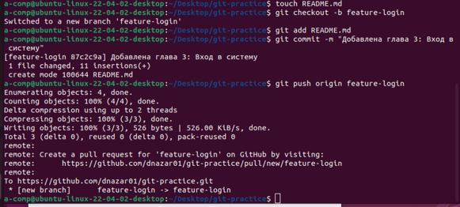

### 3)Работа с удаленным репозиторием

Переключился на основную ветку (```git checkout main```) и внес изменения, добавив название книги. Теперь файл ```README.md```
выглядит так:

```
# Название книги: Приключения в мире Git

## Глава 1: Введение
Здесь будет введение в удивительный мир Git.

## Глава 2: Основы Git
Основные понятия и команды Git.

```

Закоммитил изменения и отправил их на Github:

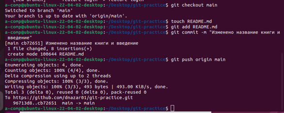

### 4)Моделирование конфликта

Вернулся на ветку ```feature-login```, внес изменения в том же участке, а также изменил главу 2. Теперь файл выглядит так:

```
# Название книги

## Глава 1: Введение
Здесь будет введение в тему книги.

## Глава 2: Основы Git и магия конфликтов
Основные понятия и команды Git, а также волшебство разрешения конфликтов.

```

Закоммитил изменения и отправил их на Github

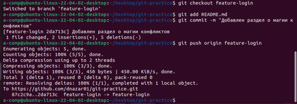

### 5)Разрешение конфликта

Вернулся в main и попробовал слить изменения. Возник конфликт.
```
git checkout main
git pull origin main
git merge feature-login
```
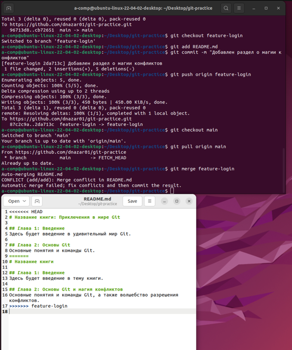

Решил конфликт редактированием файла, удалив метки и оставив нужные изменения.

```
# Название книги: Приключения в мире Git

## Глава 1: Введение
Здесь будет введение в удивительный мир Git.

## Глава 2: Основы Git и магия конфликтов
Основные понятия и команды Git, а также волшебство разрешения конфликтов.

```

### 6)Автоматизация проверки формата файлов при коммите.

Была поставлена задача - автоматически проверять, чтобы все .txt файлы в репозитории соответствовали определенному формату.
Создадим bash-скрипт check_format.sh, который будет проверять, что каждая строка в .txt файле начинается с заглавной буквы.
Его код:

```bash
#!/bin/bash

# Переменная для хранения флага наличия ошибок
has_errors=0

# Проверка всех .txt файлов в репозитории
for file in $(git diff --cached --name-only | grep '\.txt$'); do
    # Проверяем, чтобы каждая строка начиналась с заглавной буквы
    if ! grep -q '^[A-Z]' "$file"; then
        echo "Файл $file не соответствует формату!"
        has_errors=1
    fi
done

# Если найдены ошибки, отменяем коммит
if [ $has_errors -eq 1 ]; then
    echo "Коммит отменен из-за ошибок в формате файлов."
    exit 1
fi

exit 0
```

Поместил скрипт в папку ```.git/hooks``` и назвал его ```pre-commit```. Убедился что скрипт имеет права на выполнение.

```
cp check_format.sh .git/hooks/pre-commit
chmod +x .git/hooks/pre-commit
```

Для проверки создал файл test.txt и отредактировал его, затем попробовал закоммитить изменения:

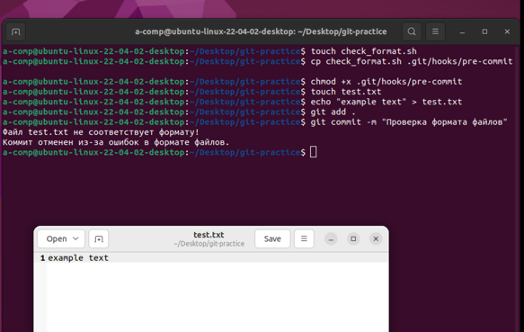

Затем изменил файл так, чтобы он соответствовал формату и успешно закоммитил его:

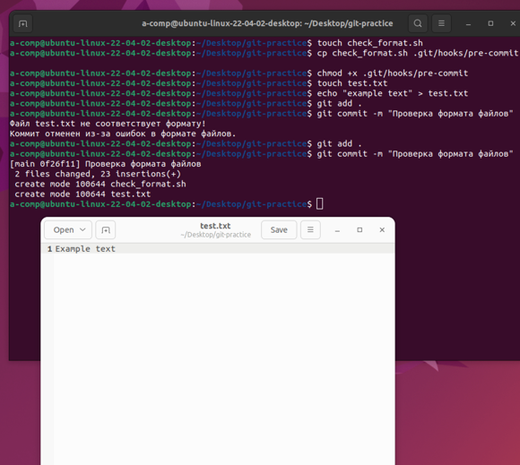

### 7)Использование Git Flow в проекте.

Создал новый репозиторий для практики Git Flow, установил Git Flow, клонировал свой репозиторий и инициализировал Git Flow.

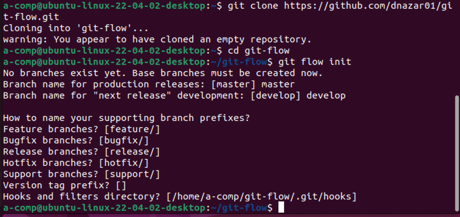

Создал ветку для новой функциональности "task-management".

```git flow feature start task-management```

Создал файл task_manager.py и внес изменения в код для добавления функционала управления задачами:

```python
def create_task(title, description):
    # Логика создания задачи
    print(f"Создана новая задача: {title}")
```

Далее сделал коммит изменений:

```
git add task_manager.py
git commit -m "Добавлен функционал управления задачами"
```

Завершил фичу, объединил ее с основной веткой командой ```git flow feature finish task-management```, Git Flow автоматически
переключился на ветку develop и выполнил слияние. Далее я переключился на ветку develop и начал создание релиза:

```
git checkout develop
git flow release start v1.0.0
```

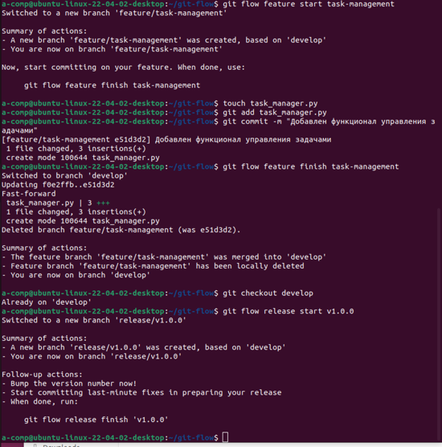

Затем я внес изменения в файл version.txt и закоммитил изменения.

```
echo "v1.0.0" > version.txt
git add version.txt
git commit -m "Обновлена версия для релиза v1.0.0"
```

Завершил релиз и объединил его с ветками develop и master. Запушил изменения.

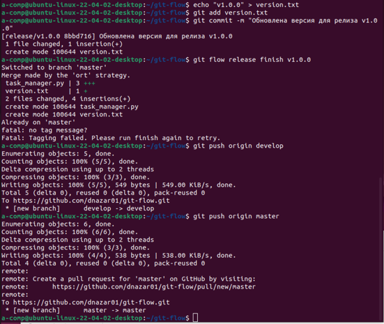

*Критических ошибок не возникало, поэтому hotfix создавать не пришлось*

## Вывод

В ходе лабораторной работы были закреплены навыки работы с Git, а также технологией Git Flow.

